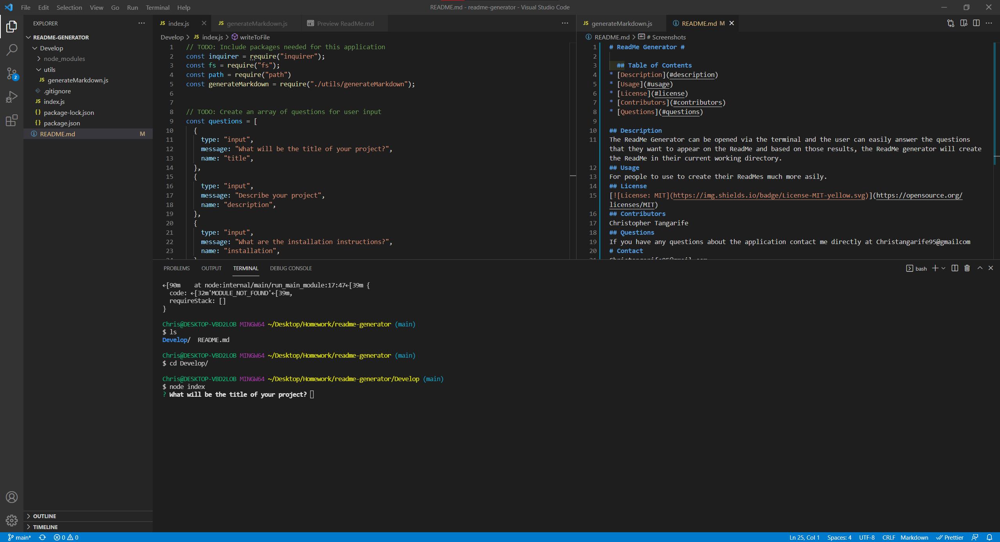

# ReadMe Generator #

  ## Table of Contents
* [Description](#description)
* [Usage](#usage)
* [License](#license)
* [Contributors](#contributors)
* [Questions](#questions)

## Description
The ReadMe Generator can be opened via the terminal and the user can easily answer the questions that they want to appear on the ReadMe and based on those results, the ReadMe generator will create the ReadMe in their current working directory.
## Usage
For people to use to create their ReadMes much more easily.
## License

## Contributors
Christopher Tangarife
## Questions
If you have any questions about the application contact me directly at Christangarife95@gmailcom 
# Contact
Christangarife95@gmail.com 
# Username
Check out my other work on [Github](https://github.com/ChrisCodes54)
# Screenshots

